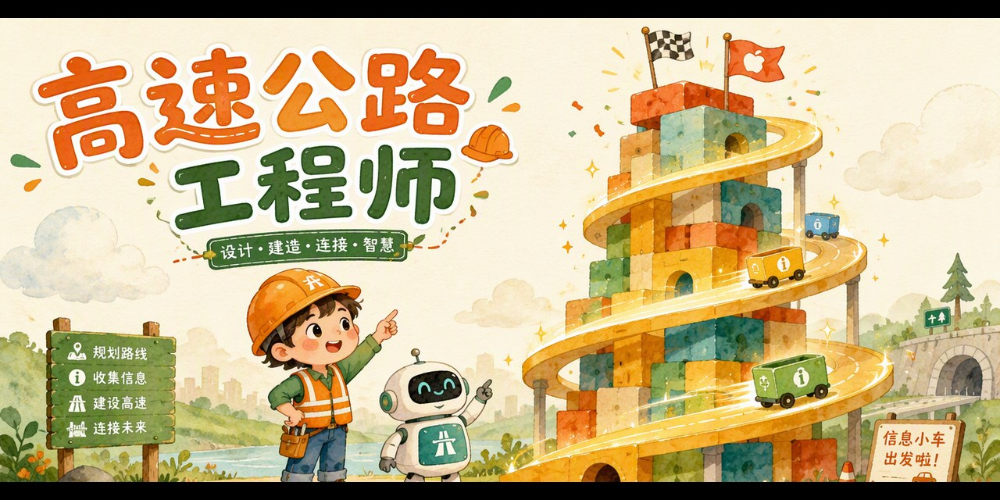

# 🛣️ AI Highway · 高速公路工程师

一个给孩子玩的 **ResNet（残差网络）启蒙网页游戏**——2015 年，中国科学家何恺明用一条「高速公路」，让 AI 大楼盖到了 152 层。

**👉 点这里直接玩：<https://pulj26pulj26.github.io/ai-highway/>**

## 怎么玩

机器人小建的「认图片大楼」总是盖不高——盖过 8 层反而变笨。你是它的工程师：

1. **第一关 · 歪歪扭扭的普通楼** 🏚️ —— 每层只能留一句话，亲眼看着大楼晃到倒塌，发现「楼为什么会塌」（退化问题）
2. **第二关 · 高速公路通车啦** 🛣️ —— 旧图纸原样直达楼顶，每层只补一句新发现，稳稳盖高楼
3. **第三关 · 挑战 152 层** 🏙️ —— 观察员里混进了不靠谱的发现！靠谱的加上去，不靠谱的「直接通过」

通关集齐三枚徽章（真相见证者 → 高速工程师 → 摩天楼大师），领取「ResNet 特级工程师证书」📜

> 💡 游戏里的两条规矩就是真实 ResNet 的核心：**跳跃连接**（原话直达）+ **只学残差**（只补差距）。「直接通过」正是残差块可以学「恒等映射」的妙处——**不用从头学，只学差多少**。

## 特点

- 📱 手机、电脑都能玩，双击打开或点开链接即可
- 🔌 单个 HTML 文件，零安装、无需联网
- 🧠 游戏机制对应真实的 ResNet 跳跃连接与恒等映射
- 👧 适合 7-14 岁孩子，配套【和孩子一起学AI】社群「AI十哲」第四课

## 本地运行

下载 `index.html`，双击用浏览器打开即可。

## 系列游戏

| 课程 | 游戏 | 仓库 |
| --- | --- | --- |
| 第一课 · 图灵测试 | 《真人还是 AI》 | [human-or-ai](https://github.com/pulj26pulj26/human-or-ai) |
| 第二课 · 感知机 | 《教机器认苹果》 | [apple-or-not](https://github.com/pulj26pulj26/apple-or-not) |
| 第三课 · 长短期记忆 | 《记忆特工队》 | [memory-agent](https://github.com/pulj26pulj26/memory-agent) |
| 第四课 · 残差网络 | 《高速公路工程师》 | **ai-highway**（本仓库） |

---

*和孩子一起学AI · AI十哲系列* —— 把经典 AI 论文变成孩子能玩的游戏。

---

# 🛣️ AI Highway

A kid-friendly web game about **ResNet (Residual Network, 2015)** — the "highway" that let AI towers grow 152 stories tall.

**👉 Play now: <https://pulj26pulj26.github.io/ai-highway/>**

## How to play

Xiao Jian the robot's "picture-reading tower" keeps wobbling — past 8 floors it gets *dumber*. You are its engineer:

1. **Level 1 · The Wobbly Tower** 🏚️ — each floor may keep only one sentence; watch the tower collapse and discover *why* (the degradation problem)
2. **Level 2 · The Highway Opens** 🛣️ — the blueprint zooms straight to the top; each floor adds only one new finding
3. **Level 3 · The 152-Floor Challenge** 🏙️ — unreliable observations sneak in! Add the solid ones, let the flaky ones "pass straight through"

Earn three badges (Truth Witness → Highway Engineer → Skyscraper Master) and your ResNet Master Engineer Certificate 📜

> 💡 The game's two rules are ResNet's real core: **skip connections** (info goes straight through) + **learning residuals** (only learn the difference). "Pass through" is exactly how residual blocks learn identity mappings.

## Features

- 📱 Works on phones and desktops — just open the link
- 🔌 One single HTML file, no install, works offline
- 🧠 Game mechanics map to real skip connections and identity mappings
- 👧 Designed for kids aged 7-14

## Run locally

Download `index.html` and double-click it.

*Part of the "AI Classics for Kids" series — turning landmark AI papers into games children can play.*
